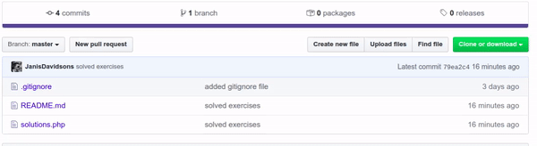
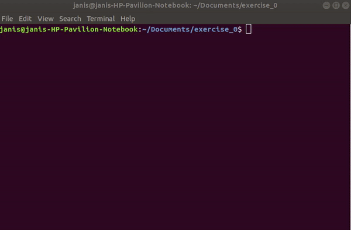
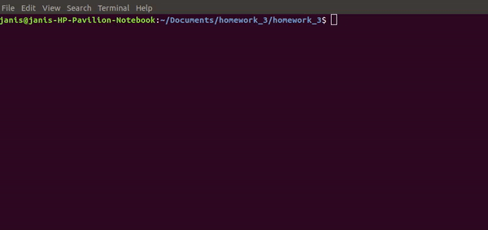
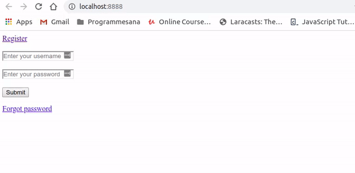
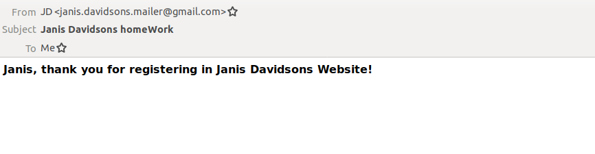
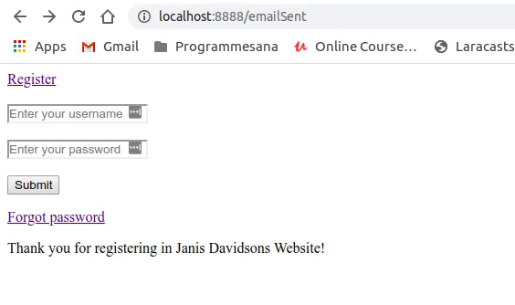

# homework_3

This project is registration / login form. It stores users data in mysql database. Everytime new user registers, email will
be sent to this user. Please follow instructions below.

    Firs copy project adress like this:

    Then open terminal within a folder, were you want to download this project.
    Enter command "git clone" and paste adress in terminal.

    Then you must enter your database credentials, like so:
    

    Start web server with command "php -S localhost:8888":
    

    Open web browser and register yourself by entering your credentials:
    

    You will receive confirmation email:
    

    Now you can log in:
    

This exercise shows:
 
          * How to build simple login/ register form.
          * How to build email service and send conmfirmation message to new users.
          * How to code simple save data and retrieve it from mysql database.
          * How to build sesions, so once user logs in, he can change browser tabs and stay logged in.
          
          
If I had more time, I would finish up password reset function. I had bug in that code, so I removed it.
